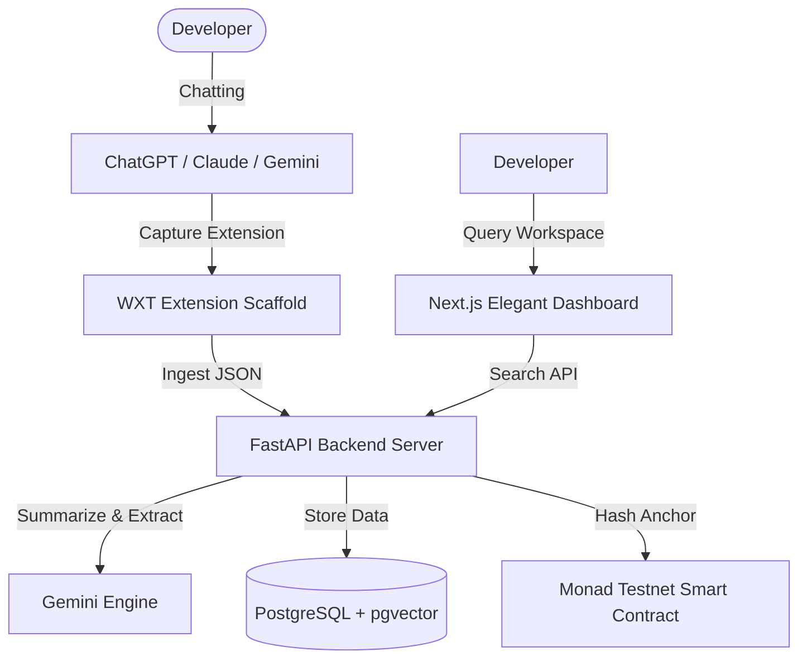

# Project Capsule

> **Winner of Monad Blitz Bangalore** 🚀
> 
> Next-generation AI-powered memory capture and semantic context retrieval agent. Automatically capture conversations from browser engines (ChatGPT, Claude, Gemini, etc.), structure key insights (decisions, risks, action items), and anchor hashes to **Monad Testnet** for absolute proof-of-work and context integrity.

---

## ⚡ Overview

When developers converse with AI (like ChatGPT or Claude), valuable engineering context, decisions, and system rules are created but immediately lost in chat histories. **Project Capsule** solves this:

1. **Capture**: A lightweight Chrome Extension captures active conversations.
2. **Compress**: The backend pipeline summarizes the chat and extracts structured metadata: **Decisions**, **Action Items**, **Important Constraints**, and **Risks**.
3. **Anchor**: Important summaries are hashed and registered on **Monad Testnet** via the `CapsuleRegistry` smart contract for verifiable context integrity.
4. **Retrieve**: Using hybrid semantic search (pgvector + BM25 + Reciprocal Rank Fusion), developers can query their workspace memory or let the CLI/MCP server automatically inject past contexts into new chats.

---

## 🏛 Architecture



---

## 🛠 Tech Stack

- **Frontend**: Next.js (App Router), TailwindCSS, React Query
- **Backend**: FastAPI (Python), SQLAlchemy, PostgreSQL, pgvector
- **Smart Contracts**: Solidity, Hardhat, Ethers.js
- **Browser Extension**: WXT (Web Extension Framework)

---

## 📦 Setup & Installation

### Prerequisites

- Node.js (v18+)
- Python 3.10+
- PostgreSQL with `pgvector` extension

### 1. Database Setup

Ensure your PostgreSQL instance is running. Create a database named `capsule_db`.
Enable the `vector` extension:

```sql
CREATE EXTENSION IF NOT EXISTS vector;
```

### 2. Backend Installation

```bash
cd backend
python -m venv venv
# On Windows:
.\venv\Scripts\activate
# On Linux/macOS:
source venv/bin/activate

pip install -r requirements.txt
```

Create a `.env` file in the `backend/` directory:

```env
POSTGRES_USER=capsule_user
POSTGRES_PASSWORD=capsule_password
POSTGRES_DB=capsule_db
POSTGRES_HOST=localhost
POSTGRES_PORT=5432

# Options: "local" (offline, sentence-transformers) or "openai"
EMBEDDING_PROVIDER=local
EMBEDDING_DIMENSIONS=384

# AI Engines
OPENAI_API_KEY=your_key_here
MONAD_PRIVATE_KEY=your_monad_wallet_private_key
```

Run database migrations:

```bash
alembic upgrade head
```

Start the backend:

```bash
uvicorn app.main:app --host 0.0.0.0 --port 8000 --reload
```

### 3. Frontend Installation

```bash
cd frontend
npm install
npm run dev
```

The elegant dashboard will run at `http://localhost:3000`.

### 4. Smart Contract Compilation & Deployment

Navigate to the `contracts/` directory:

```bash
cd contracts
npm install
npx hardhat compile
```

To deploy to the **Monad Testnet**:

```bash
npx hardhat run scripts/deploy.js --network monadTestnet
```

---

## 🔗 Monad Testnet Details

Project Capsule integrates directly with the EVM-compatible **Monad Testnet** to anchor memory states.

- **Contract Name**: `CapsuleRegistry`
- **RPC Endpoint**: `https://testnet-rpc.monad.xyz`
- **Chain ID**: `10143`
- **Token Symbol**: `MON`
- **Contract Address (Monad Testnet)**: `0xbc6D0Ecd65882357aF5dE7F0b45b083c2718E29e`

---

## 💡 Key Features & Usage

1. **Saved Chats**: View captured chats, key decisions, and action items in a chronological MacOS-style minimal layout.
2. **Memory Explorer**: Semantic hybrid retrieval to find previous technical choices.
3. **Anchor to Monad**: Every conversation detail page features an **"Anchor to Monad"** button. Connect Metamask (or rely on the relayer) to sign and commit a cryptographic hash of the capsule to the Monad Testnet block registry!
